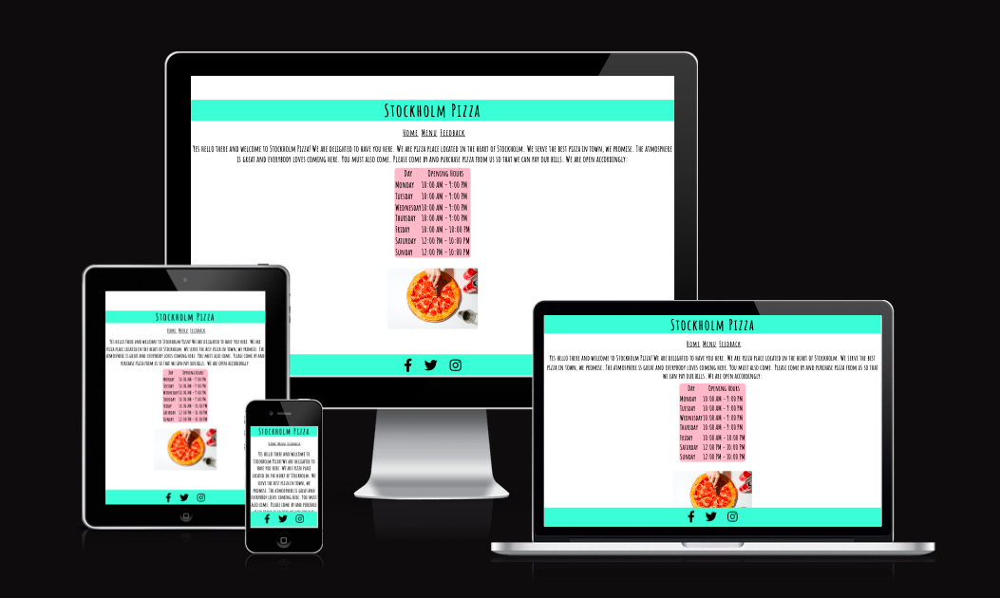
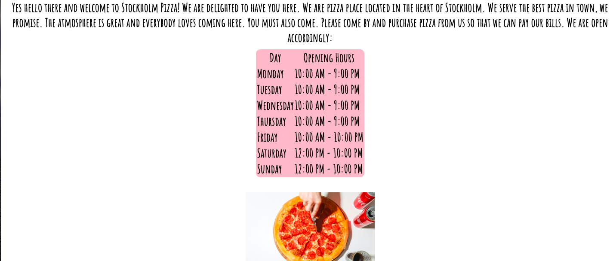
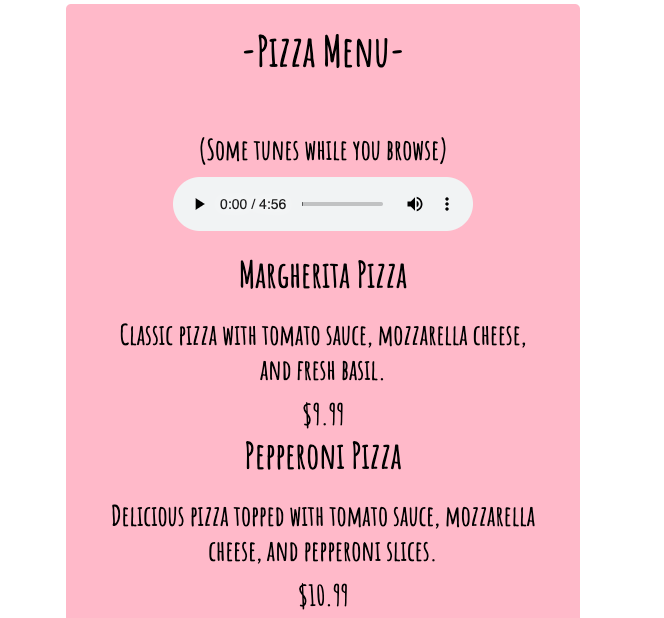
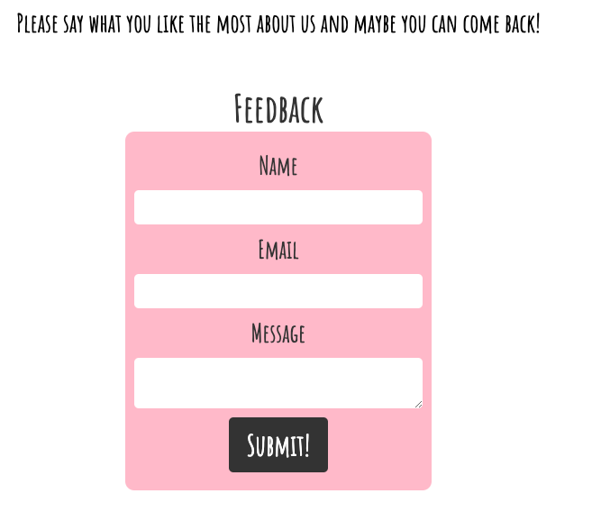
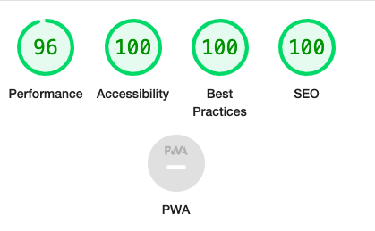

# Stockhom pizza

* The Stockholm Pizza website is a landing site for people that really loves pizza. Users of this website will be able to see the opening hours, look at an online menu (with music if they want to), and fill in a feedback-form to help the restaurant with suggestions. 

## Features
* Header - At the top of thepage you have a header that contains the restaurants name (that also works as a button to get you back to the index.html site). It becomes larger when hovered to make it works as a link. The font is easy to read and has a style that suits this cool and popular restaurant. 

* Navigation - The navigation is easy to understand, and styled in a way that makes it very clear and visible. Each link becomes slightly larger when hovered, to make it obvious that they are meant to be pushed. The navigation takes you to the three different pages in the website. Home, about or feedback.

* Footer - The footer contains three social media icons (Facebook, Twitter and Instagram) that the user can press. When they do, the page opens in a new window. 

## The "home" section
* Here the user can read a little bit about the restaurant, they can also look at a table that provides the opening hours for each day of the week. 

## The "menu" section
* A menu that lets the user choose between 5 different pizzas. While you read the menu you can play some light jazz in the audio-player provided above the menu-items. 

## The "feedback" section
* A form that the user can fill in if they want to leave a message/feedback to the restaurant. It is required to fill in the form correctly before you can submit your answers. 

### Testing
* I have tested the site in Chrome, Firefox and Safari successfully. 
* The site works and looks good on all screens sizes. 
* All the content is easy to understans and also clearly visible due to high contrast between text and background. 
* I have tested the form, it only accepts an e-mail adress in the e-mail field and the sumbit button works. 

#### Bugs
* When I deployed my project to Github Pages I noticed that the image wasn´t showing, and the audio wasn´t playable. This turned out to be caused by this incorrect file path: <source src="../lite-soft-jazz.mp3" type="audio/mpeg"> instead of <source src="lite-soft-jazz.mp3" type="audio/mpeg"> The image issue was resolved in the same way. 

##### Validator testing
* HTML - No errors were returned when passing through the official W3C validator.
* CSS - No errors were returned when passing through the official (Jigsaw) validator.
* Accessibility - I conformed that the color and fonts chosen are easy to read and accessible by running it through Lighthouse in devtools. 

